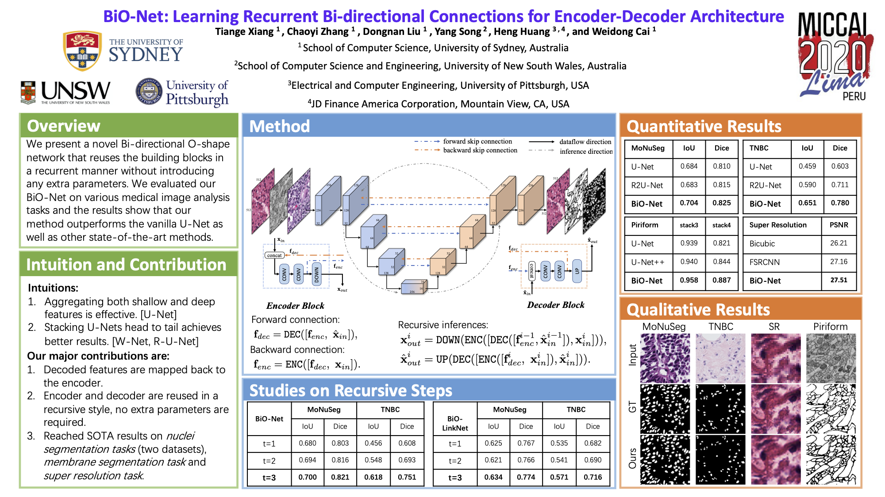

# BiO-Net
Official implementation of "BiO-Net: Learning Recurrent Bi-directional Connections for Encoder-Decoder Architecture", MICCAI 2020

Paper: https://arxiv.org/abs/2007.00243



Thanks [W2Q3Q1](https://github.com/W2Q3Q1/BiO-Net) for contributions on some of the Pytorch codes!

## Dependencies

* Python >= 3.6
* PIL >= 7.0.0
* matplotlib >= 3.3.1

*Keras version* 
* tensorflow-gpu >= 1.14.0 
* keras >= 2.1.5

*Pytorch version*
* tqdm >= 4.54.1
* imgaug >= 0.4.0
* torch >= 1.5.0
* torchvision >= 0.6.0

*NOTE1:* Keras version has been sucessfully tested on a GeForce RTX 2080 GPU with CUDA=10.1 and driver=435.21.  
*NOTE2:* You don't need all dependencies to run on a sole backend.

## Data

**Please refer to the official website (or project repo) for license and terms of usage.**
**We preprocessed the data for adaptating our data loaders. Please find the links below.**

**MoNuSeg**

- Official Website: https://monuseg.grand-challenge.org/Data/
- Baidu Disk: https://pan.baidu.com/s/1tqDzX52v8GYWXF4YfUGu1Q password: dqsr
- Google Drive: https://drive.google.com/file/d/1j7vEoq6YCBNKMoOZKPSQNciHZkVzkxGD/view?usp=sharing

**TNBC**

- Official Repo: https://github.com/PeterJackNaylor/DRFNS
- Baidu Disk: https://pan.baidu.com/s/1zPWTYAEffX55c2eyb3cU0Q password: zsl1
- Google Drive: https://drive.google.com/file/d/1RYY7vE0LAHSTQXvLx41civNRZvl-2hnJ/view?usp=sharing


## Usage  

Use ```--backend``` to switch between backends [keras, pytorch], default=Keras.

**Train**
```
python3 main.py --epochs 300 --iter 3 --integrate --train_data PATH_TO_TRAIN_DATA_ROOT \
		  --valid_data PATH_TO_VALID_DATA_ROOT --exp 1 --backend YOUR_BACKEND
```

**Evaluate**

*Save metrics and segmentations:*
```
python3 main.py --evaluate_only --save_result --valid_data PATH_TO_VALID_DATA_ROOT --exp 1  --backend YOUR_BACKEND
```
*Print metrics only:*
```
python3 main.py --evaluate_only --valid_data PATH_TO_VALID_DATA_ROOT --exp 1  --backend YOUR_BACKEND
```
*NOTE:* ```--iter```,```--integrate```,```--multiplier``` need to be specidied on the above commands.

or
```
python3 main.py --evaluate_only --valid_data PATH_TO_VALID_DATA_ROOT --model_path PATH_TO_TRAINED_MODEL  --backend YOUR_BACKEND
```


## Citation

If you find this repo useful in your work or research, please cite:

```
@inproceedings{xiang2020bio,
  title={BiO-Net: Learning Recurrent Bi-directional Connections for Encoder-Decoder Architecture},
  author={Xiang, Tiange and Zhang, Chaoyi and Liu, Dongnan and Song, Yang and Huang, Heng and Cai, Weidong},
  booktitle={International Conference on Medical Image Computing and Computer-Assisted Intervention},
  pages={74--84},
  year={2020},
  organization={Springer}
}
```


